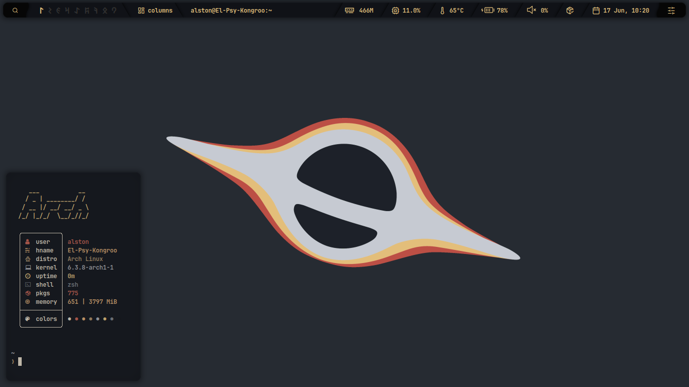
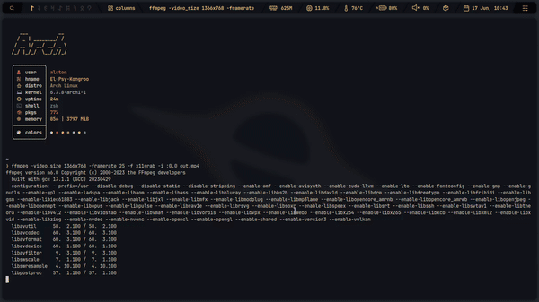
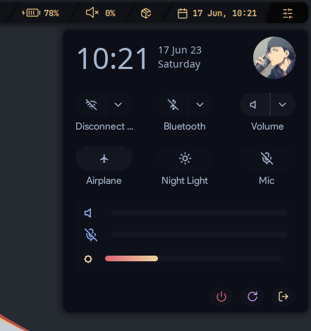
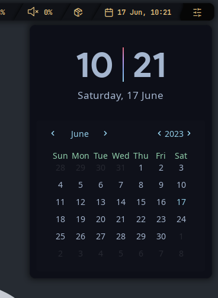
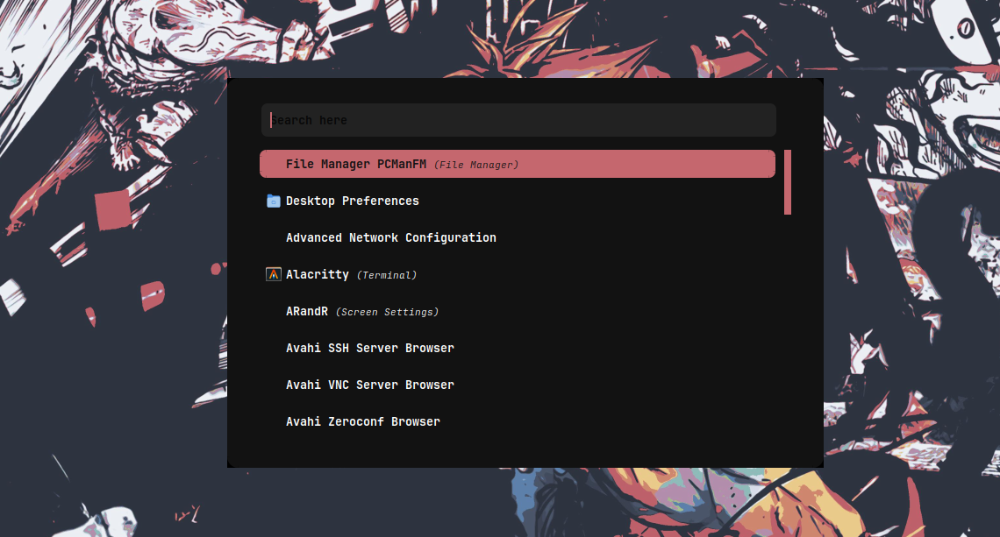
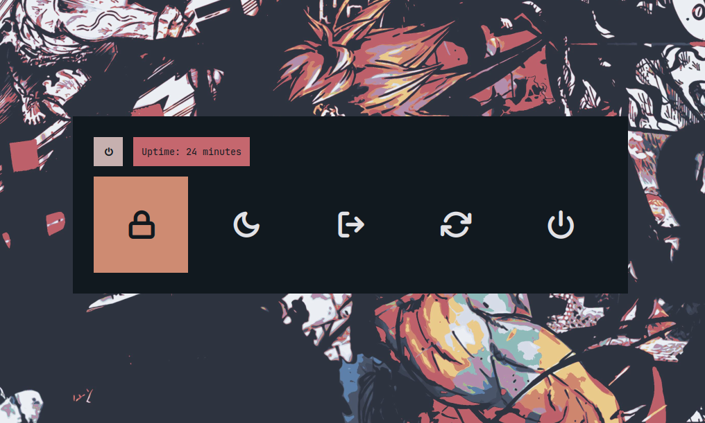
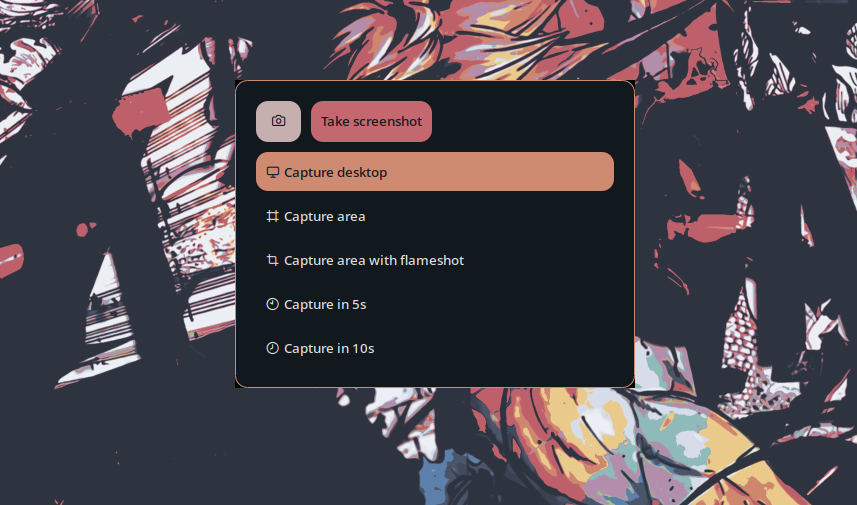

# Hey there!! This is my first Qtile rice

## Screenshots

| fetch|
|--|
||

| color changer|
|--|
||

| action center|
|--|
||

| calendar|
|--|
||

| app launcher|
|--|
||

| powermenu|
|--|
||

| print menu|
|--|
||


## INSTALLATION  (Arch Linux)

#### Note: This installation script is specifically designed for Arch Linux. It will work for a freshly installed system. If you've been using a different window manager, no worries - just be sure to take a complete backup of your current dots before running the script. And if you're already using Oh My Zsh, don't forget to remove that folder from your home directory

<details>
<summary><h3>Automated Installation</h3></summary>

- Clone the repo and cd into the cloned folder.

```sh
git clone https://github.com/05Alston/qtyle
cd qtyle
```

#### Now that you're in the cloned folder, it's time to run the script

- Make the script executable

```sh
chmod +x install.sh
```

- Run the script

```sh
./install.sh
```

#### Once the script finishes its work and launches lightdm, it's time to choose Qtile from the WM selector and dive right into the Amazing world of Qtile!

</details>

<details>
<summary><h3>MANUAL INSTALLATION (Universal)</h3></summary>

#### Note: While this guide is primarily intended for Arch Linux users, If you're running a different OS like Fedora, NixOS, or Debian. You'll still be able to follow along and get a clear idea of how to set things up. (using your OS's package manager and other tools)

#### Keep in mind that this configuration is tailored to assume that the main files, like ".config", will be located in the home folder (~/). However, if that's not the case for you, don't worry - you'll just need to make a few manual adjustments to the dotfiles.

<details>
<summary><h3>Dependencies</h3></summary>

#### To get started, let's make sure we have all the necessary prerequisites. In this case, I'm using Paru as the AUR helper, but keep in mind that your system may require a different approach.

- Installation using paru

```sh
paru -Syu base-devel qtile python-psutil pywal-git viewnior feh picom-jonaburg-fix dunst zsh starship alacritty nitch neovim brightnessctl rofi ranger cava pulseaudio alsa-utils pavucontrol pamixer mpv pulseaudio-alsa pulseaudio-bluetooth playerctl acpi btop noto-fonts noto-fonts-extra papirus-icon-theme xarchiver unzip networkmanager nm-connection-editor maim flameshot arandr blueman bluez bluez-utils i3lock-color tlp redshift nodejs-lts-hydrogen npm --noconfirm --needed
```

- Fonts required for the bar and other utils

 ➺ Any nerd font

 ➺ [JetBrains Mono](https://www.jetbrains.com/lp/mono/)

#### You could either download the zip files for these fonts and put them into ``~/.local/share/fonts/`` or ``/usr/share/fonts/``

#### You could also copy them from the ``.local/share/fonts/required`` directory. The fonts directory contains a lot of fonts that I use on my system so you'd be bloating your system if you don't require other fonts.

</details>

<details>
<summary><h3>Shell</h3></summary>

#### Next step is to install and setup the shell.

- Change the default shell to Zsh

```sh
chsh -s $(which zsh)
```

- Setting up Oh-my-zsh & plugins
  
```sh
sh -c "$(curl -fsSL https://raw.githubusercontent.com/ohmyzsh/ohmyzsh/master/tools/install.sh)" "" --unattended 
git clone https://github.com/zsh-users/zsh-autosuggestions ${ZSH_CUSTOM:-~/.oh-my-zsh/custom}/plugins/zsh-autosuggestions
git clone https://github.com/zsh-users/zsh-syntax-highlighting.git ${ZSH_CUSTOM:-~/.oh-my-zsh/custom}/plugins/zsh-syntax-highlighting
```

</details>

<details>
<summary><h3>Dotfiles</h3></summary>

#### With all the necessary prerequisites now installed, the next step is to replicate my setup by copying the dotfiles

- Clone the repo and cd into the cloned folder.

```sh
git clone https://github.com/05Alston/qtyle 
cd Cozytile
```

#### Now that you're in the cloned folder, it's time to copy those files over to your home directory.

- Copy the files using cp

```sh
cp -R ./. ~/
```

</details>

<details>
<summary><h3>Final step</h3></summary>

#### Now that you're done with copying the dotfiles, it's time to hop into Qtile. This requires installing a display manager like lightdm. Here are the steps to install lightdm:

- Install it using paru

```sh
paru -Sy lightdm
```

- Enable and start lightdm

```sh
sudo systemctl enable lightdm && sudo systemctl start lightdm
```

#### Now that you're in the login screen of lightdm, just select Qtile from wm selector, then login with your root password! viola ✨

- Enjoy!

#### Congratulations! You have successfully replicated my setup! Feel free to experiment with the configurations and enjoy!!!

</details>

</details>

<details>
<summary><h3>KEYBINDS</h3></summary>

| Key | Bind |
|:-|:-|
||
| <kbd>Control</kbd> + <kbd>Grave(~)</kbd> | Launch terminal as scratchpad |
| <kbd>super</kbd> + <kbd>Return</kbd> | Launch terminal |
| <kbd>Control</kbd> + <kbd>q</kbd> | Kill active window |
| <kbd>super</kbd> + <kbd>Tab</kbd> | Next layout |
| <kbd>super</kbd> + <kbd>Shift</kbd> + <kbd>Tab</kbd> | Previous layout |
| <kbd>super</kbd> + <kbd>Shift</kbd> + <kbd>r</kbd> | Restart Qtile |
| <kbd>super</kbd> + <kbd>Control</kbd> + <kbd>r</kbd> | Reload config file |
| <kbd>super</kbd> + <kbd>Control</kbd> + <kbd>q</kbd> | Quit Qtile |
| <kbd>super</kbd> + <kbd>r</kbd> | Appmenu |
| <kbd>super</kbd> + <kbd>x</kbd> | Powermenu |
| <kbd>Alt</kbd> + <kbd>Tab</kbd> | Next window on current screen |
| <kbd>Alt</kbd> + <kbd>Shift</kbd> + <kbd>Tab</kbd> | Previous window on current screen |
| <kbd>super</kbd> + <kbd>Left</kbd> | Move focus to left |
| <kbd>super</kbd> + <kbd>Right</kbd> | Move focus to right |
| <kbd>super</kbd> + <kbd>Down</kbd> | Move focus to down |
| <kbd>super</kbd> + <kbd>Up</kbd> | Move focus to up |
| <kbd>super</kbd> + <kbd>Shift</kbd> + <kbd>Left</kbd> | Move window to left |
| <kbd>super</kbd> + <kbd>Shift</kbd> + <kbd>Right</kbd> | Move window to right |
| <kbd>super</kbd> + <kbd>Shift</kbd> + <kbd>Down</kbd> | Move window to down |
| <kbd>super</kbd> + <kbd>Shift</kbd> + <kbd>Up</kbd> | Move window to up |
| <kbd>super</kbd> + <kbd>Control</kbd> + <kbd>Left</kbd> | Flip layout left |
| <kbd>super</kbd> + <kbd>Control</kbd> + <kbd>Right</kbd> | Flip layout right |
| <kbd>super</kbd> + <kbd>Control</kbd> + <kbd>Down</kbd> | Flip layout down |
| <kbd>super</kbd> + <kbd>Control</kbd> + <kbd>Up</kbd> | Flip layout up |
| <kbd>super</kbd> + <kbd>Alt</kbd> + <kbd>Left</kbd> | Grow window to left |
| <kbd>super</kbd> + <kbd>Alt</kbd> + <kbd>Right</kbd> | Grow window to right |
| <kbd>super</kbd> + <kbd>Alt</kbd> + <kbd>Down</kbd> | Grow window to down |
| <kbd>super</kbd> + <kbd>Alt</kbd> + <kbd>Up</kbd> | Grow window to up |
| <kbd>super</kbd> + <kbd>m</kbd> | Toggle maximize window |
| <kbd>super</kbd> + <kbd>Shift</kbd> + <kbd>f</kbd> | Toggle fullscreen window |
| <kbd>super</kbd> + <kbd>Alt</kbd> + <kbd>f</kbd> | Toggle floating window |
| <kbd>super</kbd> + <kbd>i</kbd> | Grow window in floating mode |
| <kbd>super</kbd> + <kbd>Shift</kbd> + <kbd>i</kbd> | Shrink window in floating mode |
| <kbd>super</kbd> + <kbd>f</kbd> | Open file manager (change config for your choice of app) |
| <kbd>super</kbd> + <kbd>w</kbd> | Open web browser (change config for your choice of app) |
| <kbd>super</kbd> + <kbd>c</kbd> | Open code editor (change config for your choice of app) |
| <kbd>super</kbd> + <kbd>l</kbd> | Lockscreen |
| <kbd>super</kbd> + <kbd>v</kbd> | Open pavucontrol as scratchpad |
| <kbd>super</kbd> + <kbd>b</kbd> | Open blueman as scrathcpad |
| <kbd>Print</kbd> | Open print menu |
| <kbd>Fn</kbd> + <kbd>F5</kbd> / <kbd>super</kbd> + <kbd>p</kbd> | Monitor settings |
| <kbd>Fn</kbd> + <kbd>Raise volume</kbd> | Increase volume |
| <kbd>Fn</kbd> + <kbd>Lower volume</kbd> | Decrease volume |
| <kbd>Fn</kbd> + <kbd>Raise brightness</kbd> | Increase brightness |
| <kbd>Fn</kbd> + <kbd>Lower brightness</kbd> | Decrease brightness |
| <kbd>Fn</kbd> + <kbd>Previous</kbd> | Previous track |
| <kbd>Fn</kbd> + <kbd>Next</kbd> | Next track |
| <kbd>Fn</kbd> + <kbd>Play/Pause</kbd> | Play/Pause |
| <kbd>Fn</kbd> + <kbd>Mute</kbd> | Mute |
| <kbd>Fn</kbd> + <kbd>Stop</kbd> | Stop |
| <kbd>super</kbd> + Left Click | Set window as floating |
| <kbd>super</kbd> + <kbd>Alt</kbd> + Left Click | Set floating window size |

</details>

## CREDITS

I've yoinked stuff from various places.

- The [Cozytile](https://github.com/darkkal44/Cozytile/) setup from [darkkal44](https://github.com/darkkal44/) was a huge inspiration.
- [rofi](github.com/adi1090x/rofi) scripts from [adi1090x](github.com/adi1090x)
- [Paledark](https://github.com/Myagko/dotfiles) GTK theme from [Myagko](https://github.com/Myagko)

---

<div align="center">

#### Have a nice day!

</div>
